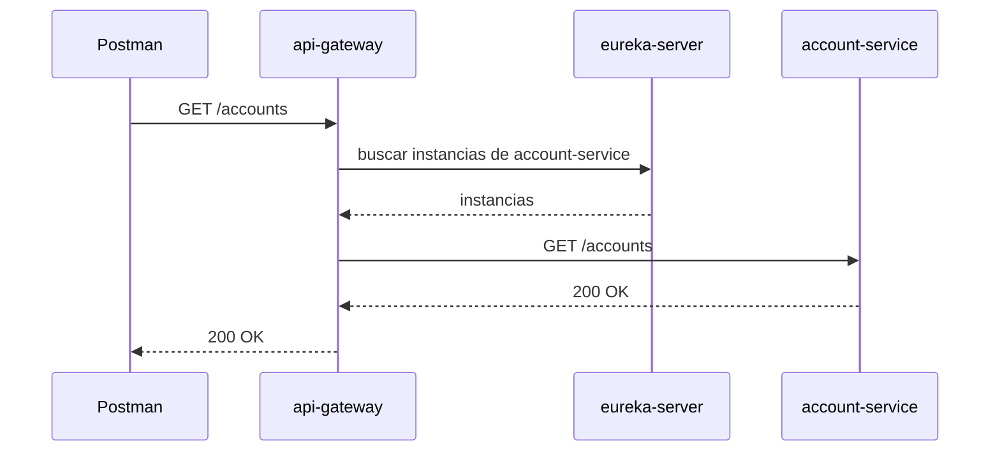

# Diagramas

## Secuencia: enrutamiento

```mermaid
sequenceDiagram
  Postman->>api-gateway: GET /accounts
  api-gateway->>eureka-server: buscar instancias de account-service
  eureka-server-->>api-gateway: instancias
  api-gateway->>account-service: GET /accounts
  account-service-->>api-gateway: 200 OK
  api-gateway-->>Postman: 200 OK
```
