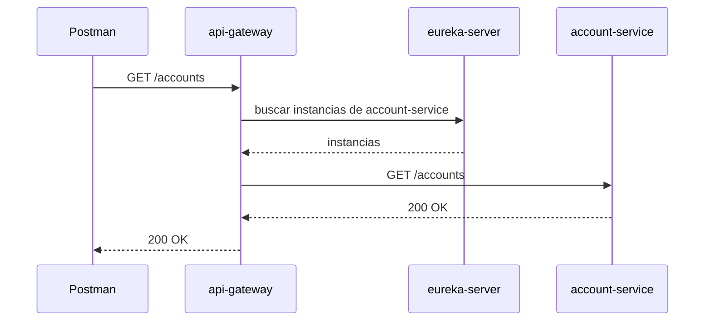
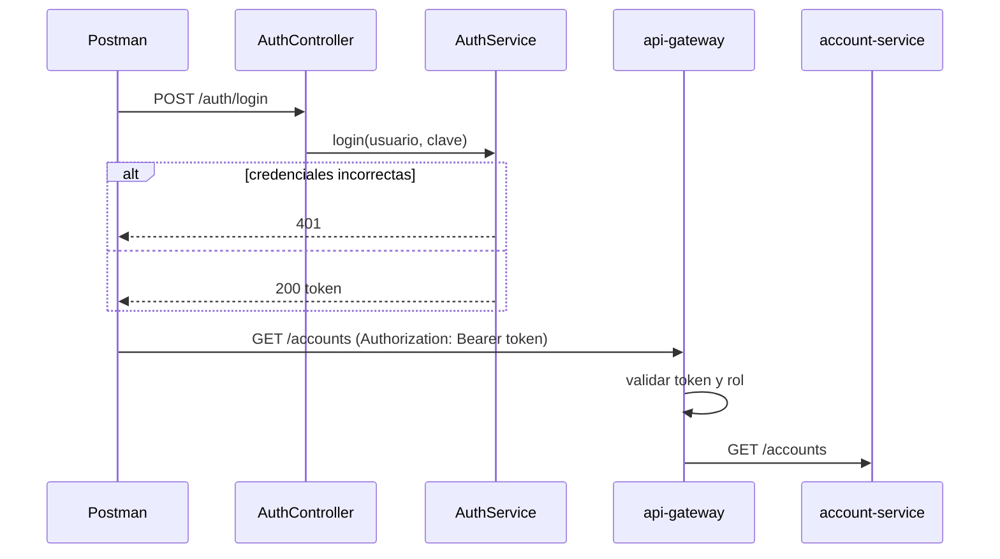

# Diagramas

## Secuencia: enrutamiento

```mermaid
sequenceDiagram
  Postman->>api-gateway: GET /accounts
  api-gateway->>eureka-server: buscar instancias de account-service
  eureka-server-->>api-gateway: instancias
  api-gateway->>account-service: GET /accounts
  account-service-->>api-gateway: 200 OK
  api-gateway-->>Postman: 200 OK
```

## Secuencia: login con JWT

```mermaid
sequenceDiagram
  Postman->>AuthController: POST /auth/login
  AuthController->>AuthService: login(usuario, clave)
  alt credenciales incorrectas
    AuthService-->>Postman: 401
  else
    AuthService-->>Postman: 200 token
  end
  Postman->>api-gateway: GET /accounts (Authorization: Bearer token)
  api-gateway->>api-gateway: validar token y rol
  api-gateway->>account-service: GET /accounts
```
